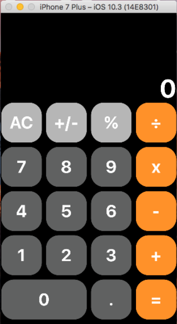
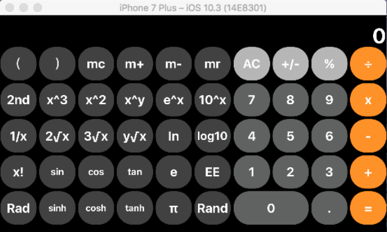

<<<<<<< HEAD
# 基本配置
开发环境：MacOs 10.12.5   
开发工具：Xcode 8.3.3   
模拟环境：iphone7 Plus   

# 效果展示   
竖屏：   
----------------------
   
横屏：   
----------------------
   

# 视频演示   
https://www.bilibili.com/video/BV1g44y1t7Tt/

# （小）项目开发历程及踩坑总结 
开发历程
----------------------------------
1、学会使用简单的autolayout，能拼出竖屏计算器的布局。 

2、不知道怎么才能让横竖屏显示不一样的内容，试图通过多个view    controller（被老师否定）、固定竖屏部分的宽度（太想当然了，不行）来实现横竖屏内容，均以失败告终。  

3、研究许久后发现，在每一个UI的设定中，可以分开设定横屏和竖屏下的不同参数，也可以通过install选项来选择性加载部分按钮。在多次尝试、总结并增加了一堆autolayout功能之后，最终实现了横竖屏的按键布局。  

4、实现各种操作符功能、计算功能等，以及一些简单的特效，例如双目操作符被按下、选择2nd模式等。对数据溢出或表达式有误的情况，屏幕显示"ERROR"。  

5、完成存储、Rad和Deg模式切换等，并处理了一些bug。其中有一个匪夷所思的bug：在switch语句的某一个case中执行return操作后，还会重复执行一遍这个switch，但在return后增加一行便解决了。。。至今未能理解

踩坑总结
----------------------------------
这次作业的挑战性是我从未经历过的，甚至之前的高程大作业、数电大实验这些让同学们“闻风丧胆”的东西，也没有这次的作业带来的如此多方面的挑战。   

首先是与作业内容关系不大的挑战。由于没有mac电脑，也没能装到好用的黑苹果，本人只能在一个低版本、鼠标移动都有些卡的虚拟机下，用xcode8进行开发。索性本次作业所需的功能都能在xcode8中找到，但这样的在（超级）非理想环境下开发的经验对我而言真的是前所未有。  

而作业内容本身也是颇具难度。刚见到这个作业时，我认为中缀表达式转后缀表达式会是计算器程序中的一个难点，然而各种UI布局、autolayout（尤其困难，翻转屏幕时会遇到各种各样恶心的情况）才是真正的挑战。  

另外，MVC的模式的确方便好用（虽然在虚拟机的小屏幕+卡顿的鼠标移动下简直让人抓狂），但是总感觉在目前的项目中，许多使用其他语言中可以用自定义信号来实现的功能，在xcode的开发中有严格的限制（也可能是我没完全琢磨透），虽然目前看来既有功能强大且较为齐全，但是有些时候确实会明显感受到有些束手束脚。  

# 感悟与收获
上一条都是被打的鼻青脸肿的经验教训，当然也算收获，就不再赘述，从积极的方面讲讲。  

首先，这门课是IOS开发。iOS程序这对我而言是完全没有经验、仅从使用层面上有些了解的程序。不同于我较为熟悉的PC端控制台或桌面程序开发，IOS的开发首先是手机端、指向性极强的程序开发方式。“底层”在IOS开发过程中明显比重更低，大多数代码基本上都与用户操作直接相关，简易的修改也能直观地在模拟器上感受到。由于软工的安卓开发还没开始实验，IOS的这种开发经验对我而言是前所未有的。  

而MVC的程序开发模式，对我而言还是第一次在作业中使用。在各种游戏引擎中，我见过许多比重不一的MVC，但是IOS开发中将MVC作为基本开发方式仍让我很惊讶。我在网络上查阅得知，MVC模式具有低耦合性、高重用性、部署快且生周期成本低、可维护性高的优点。而从我的本次程序开发角度出发，MVC的高重用性让我感受甚多。在我前两次推倒重来（第一次是因为没看视频就写了，结果没用Calculator类；第二次是删除掉之前view controller切换，改成在一个scene中）的经验中，每次我都有大量可以简单复用的部分，且只需要对接口进行小规模的修改，便可以将大量的可视化部件以及大量代码完美结合。这样清晰的逻辑也是可维护性高的体现。当然，MVC也具有理解难度高的特点，我也深有体会。。。  

还有一点，算不上经验教训，但也确实是我以后需要改进的方向。那便是我对这种功能复杂的程序的宏观设计能力仍有欠缺，以及某些细节实现的方式过于笨拙。诸多变量，特别是状态机变量，在我的设计过程中总有些杂乱无章。经常在判断某种情况时，没法精准地描述我所需要的状态，但若增加新的状态机变量又显得冗余。另外，在我模仿曹老师的视频实现简易版计算器过程中，无论是写法还是面向对象编程模式，在代码中都能感受到清晰地逻辑结构。可惜，更复杂的功能让我没法模仿那样的风格开发下去。回头看看我写的一大堆乱七八糟的只有我自己认为逻辑清晰的代码，我还有很长的路要走啊。。。
=======
# aaaa
<iframe src="//player.bilibili.com/player.html?aid=975835786&bvid=BV1g44y1t7Tt&cid=417762114&page=1" scrolling="no" border="0" frameborder="no" framespacing="0" allowfullscreen="true"></iframe>
>>>>>>> c39f86e5f9bb2c0e012213296254106724e47f35
